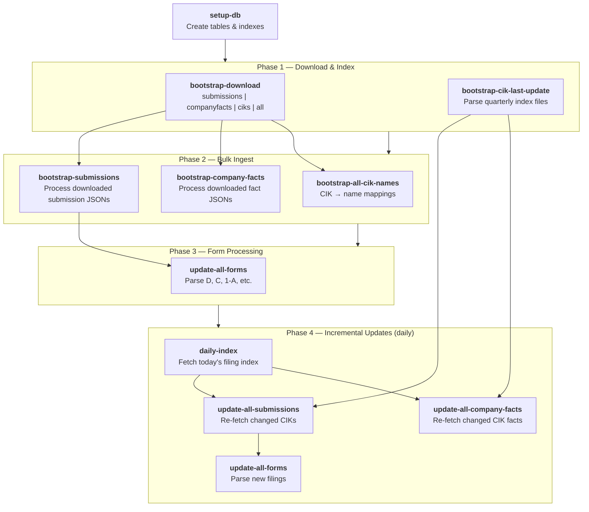
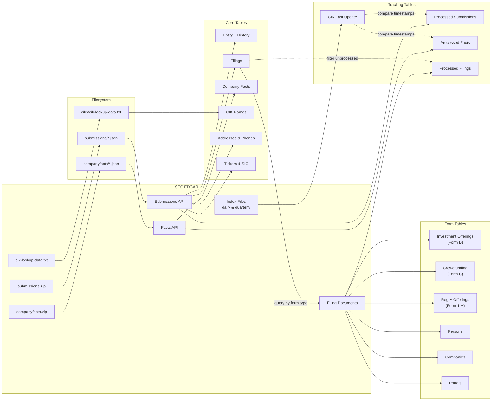

# @workglow/sec — CLI Specification

A CLI tool for retrieving and storing SEC EDGAR filing data into a local SQLite database. Fetches company identifiers, filing indexes, submissions, XBRL facts, and parses individual form types (Form D, Form C, Form 1-A, etc.) into normalized relational data.

**Runtime:** Bun **CLI Framework:** Commander.js **Database:** SQLite (single file) or Postgres (network)

---

## 0. Data Pipeline Overview

### 0.1 Operational Workflow

Shows the typical order of operations from initial setup through incremental updates.

### 0.2 Data Flow

Shows how data flows from SEC EDGAR through commands into database tables, and what each command reads vs. writes.

### 0.3 Command → Data Mapping

| Command                     | Reads                                  | Writes                                                                  |
| --------------------------- | -------------------------------------- | ----------------------------------------------------------------------- |
| `bootstrap-download`        | SEC bulk archives                      | Raw files (filesystem)                                                  |
| `bootstrap-all-cik-names`   | Raw CIK file                           | CIK Names                                                               |
| `bootstrap-cik-last-update` | SEC index files                        | CIK Last Update                                                         |
| `bootstrap-submissions`     | Raw submission files                   | Entity, Filings, Addresses, Phones, Tickers, SIC, Processed Submissions |
| `bootstrap-company-facts`   | Raw fact files                         | Company Facts, Processed Facts                                          |
| `submissions <cik>`         | SEC submissions API                    | Entity, Filings, Addresses, Phones, Tickers, SIC, Processed Submissions |
| `company-facts <cik>`       | SEC facts API                          | Company Facts, Processed Facts                                          |
| `daily-index`               | SEC daily index                        | CIK Last Update                                                         |
| `form <cik> <form>`         | Filings table, SEC filing docs         | Form-specific tables, Processed Filings                                 |
| `update-all-submissions`    | CIK Last Update, Processed Submissions | Entity, Filings, Addresses, Phones, Tickers                             |
| `update-all-company-facts`  | CIK Last Update, Processed Facts       | Company Facts                                                           |
| `update-all-forms`          | Filings, Processed Filings             | Form-specific tables                                                    |

---

## 1. CLI Commands

### 1.1 Database Setup

#### `setup-db`

Initialize all database tables and indexes. Must be run before any other command.

---

### 1.2 Bootstrap Commands

These commands populate the database from bulk SEC data.

#### `bootstrap-download <type>`

Download and extract bulk SEC data archives.

| Argument | Required | Description                                          |
| -------- | -------- | ---------------------------------------------------- |
| `type`   | Yes      | One of: `submissions`, `companyfacts`, `ciks`, `all` |

**Behavior:**

- `submissions` → Downloads `https://www.sec.gov/Archives/edgar/daily-index/bulkdata/submissions.zip`, extracts to `SEC_RAW_DATA_FOLDER/submissions/`
- `companyfacts` → Downloads `https://www.sec.gov/Archives/edgar/daily-index/xbrl/companyfacts.zip`, extracts to `SEC_RAW_DATA_FOLDER/companyfacts/`
- `ciks` → Downloads `https://www.sec.gov/Archives/edgar/cik-lookup-data.txt`, extracts to `SEC_RAW_DATA_FOLDER/ciks/`
- `all` → Downloads both
- Validates extracted paths to prevent directory traversal

#### `bootstrap-all-cik-names`

Fetch and store all company CIK-to-name mappings.

**Behavior:**

- Uses file from `SEC_RAW_DATA_FOLDER/ciks/`, see `bootstrap-download` command
- Parses colon-delimited lines (`name:cik:`)
- Stores each CIK-name pair in the database

#### `bootstrap-cik-last-update [--year <year>] [--quarters <quarters>]`

Build a table of when each CIK was last updated by parsing filing indexes.

| Option     | Required | Description                                         |
| ---------- | -------- | --------------------------------------------------- |
| `year`     | No       | Specific year (1993+).                              |
| `quarters` | No       | Specific how many quarters to fetch. Defaults to 1. |

**Behavior:**

- If year provided: fetches quarterly indexes for all 4 quarters of that year
- If quarters provided: fetches the specified number of previously quarters that include the current quarter
- If neither year nor quarters provided: fetches the current quarter's index only
- Parses pipe-delimited master index files to extract CIK update dates
- Stores the most recent update date per CIK
- Can only supply either year or quarters, not both.

#### `bootstrap-submissions`

Process pre-downloaded submission files from `SEC_RAW_DATA_FOLDER/submissions/`.

| Option      | Required | Description        |
| ----------- | -------- | ------------------ |
| `concurent` | 2        | Concurrency limit. |

**Behavior:**

- Scans for `CIK{10-digit-padded}.json` files
- Skips submissions already marked as processed
- For each unprocessed CIK: fetches submission data and stores it (same as `submissions` command)
- Concurrency limit: 2 by default, can be overridden with the `--concurent` option

#### `bootstrap-company-facts`

Process pre-downloaded company fact files from `SEC_RAW_DATA_FOLDER/companyfacts/`.

**Behavior:**

- Scans for `CIK{10-digit-padded}.json` files
- Skips CIKs already marked as processed
- For each unprocessed CIK: fetches facts and stores them (same as `company-facts` command)
- Concurrency limit: 2

---

### 1.3 Fetch Commands

These commands fetch and store data for individual entities.

#### `submissions <cik>`

Fetch and store all submission data for a company.

| Argument | Required | Description                 |
| -------- | -------- | --------------------------- |
| `cik`    | Yes      | Central Index Key (numeric) |

| Option          | Description                            |
| --------------- | -------------------------------------- |
| `--date <date>` | Cache-busting date (defaults to today) |

**Behavior:**

1. Fetches main submission JSON from `https://data.sec.gov/submissions/CIK{cik-padded}.json`
2. If the response includes additional filing batch files, fetches each one
3. Combines all filing records
4. Stores in parallel:
   - Entity metadata (name, type, SIC, EIN, website, category, fiscal year, state of incorporation)
   - Contact info (mailing and business addresses, phone numbers)
   - SIC code description
   - Ticker-exchange pairs
   - All filing records
5. Marks CIK as processed with current timestamp

#### `company-facts <cik>`

Fetch and store XBRL financial facts for a company.

| Argument | Required | Description                 |
| -------- | -------- | --------------------------- |
| `cik`    | Yes      | Central Index Key (numeric) |

| Option          | Description   |
| --------------- | ------------- |
| `--date <date>` | Specific date |

**Behavior:**

1. Fetches from `https://data.sec.gov/api/xbrl/companyfacts/CIK{cik-padded}.json`
2. Linearizes the nested facts structure (taxonomy → fact name → unit → data points) into flat records
3. Stores in batches of 1,000 records
4. Marks CIK facts as processed

#### `daily-index [date]`

Fetch a daily filing index and update CIK last-update timestamps.

| Argument | Required | Description                                   |
| -------- | -------- | --------------------------------------------- |
| `date`   | No       | Date in YYYY-MM-DD format (defaults to today) |

**Behavior:**

- Fetches `https://www.sec.gov/Archives/edgar/daily-index/{year}/QTR{quarter}/master.{YYMMDD}.idx`
- Parses pipe-delimited index: `CIK|Company Name|Form Type|Date Filed|Filename`
- Extracts unique CIKs and updates their last-update timestamps

#### `form <cik> <form> [docid]`

Parse and store specific form filings for a company.

| Argument | Required | Description                          |
| -------- | -------- | ------------------------------------ |
| `cik`    | Yes      | Central Index Key                    |
| `form`   | Yes      | Form type (e.g., `D`, `C`, `1-A`)    |
| `docid`  | No       | Specific accession number to process |

**Behavior:**

- Queries the filings table for matching CIK + form type
- If `docid` provided, filters to that specific accession number
- For each filing: fetches the primary document and parses it using the appropriate form parser
- Stores extracted data and marks the filing as processed

#### `doc <docid> [fileName]`

Process a single accession document.

| Argument   | Required | Description                         |
| ---------- | -------- | ----------------------------------- |
| `docid`    | Yes      | Accession number                    |
| `fileName` | No       | Specific filename within the filing |

**Behavior:**

- Fetches the document from `https://www.sec.gov/Archives/edgar/data/{cik}/{accession}/{fileName}`
- Routes to the appropriate form parser based on form type
- Stores extracted data

---

### 1.4 Update Commands

These commands incrementally update existing data.

#### `update-all-submissions`

Update submissions for all companies that have new filings.

**Behavior:**

1. Reads all CIK last-update timestamps
2. Reads all processed-submissions timestamps
3. Identifies:
   - CIKs with updates but never processed → processes with concurrency 2
   - CIKs with updates newer than last processing → processes with concurrency 1
4. For each: runs the same fetch-and-store flow as `submissions`

#### `update-all-company-facts`

Update XBRL facts for all companies that have new data.

**Behavior:**

1. Same comparison logic as update-all-submissions
2. Initial processing: concurrency 10
3. Updates: concurrency 1
4. For each: runs the same fetch-and-store flow as `company-facts`

#### `update-all-forms <form>`

Process all unprocessed filings for given form types.

| Argument | Required | Description                                  |
| -------- | -------- | -------------------------------------------- |
| `form`   | Yes      | Comma-separated form types (e.g., `D,C,1-A`) |

**Behavior:**

1. Queries filings table for matching form types
2. Filters out already-processed filings (via processed-filings table)
3. Processes all remaining with concurrency 10
4. For each: fetches document, parses form, stores data

---

## 2. Data Model

### 2.1 Core Entities

#### Entity

The central record for any SEC-registered entity (company, fund, individual).

| Column                     | Type    | Constraints            | Description                        |
| -------------------------- | ------- | ---------------------- | ---------------------------------- |
| `cik`                      | Integer | **PK**, &gt;= 0        | Central Index Key                  |
| `name`                     | String  | nullable               | Entity name                        |
| `type`                     | String  | nullable               | Entity type                        |
| `sic`                      | Integer | 0–9999, nullable       | Standard Industrial Classification |
| `ein`                      | String  | max 10, nullable       | Employer Identification Number     |
| `description`              | String  | nullable               | Business description               |
| `website`                  | String  | nullable               | Company website                    |
| `investor_website`         | String  | nullable               | Investor relations website         |
| `category`                 | String  | nullable               | SEC category                       |
| `fiscal_year`              | String  | max 4 (MMDD), nullable | Fiscal year end                    |
| `state_incorporation`      | String  | max 2, nullable        | State code                         |
| `state_incorporation_desc` | String  | nullable               | State name                         |

#### Entity History

Tracks temporal changes to entity records.

| Column                 | Type     | Constraints | Description              |
| ---------------------- | -------- | ----------- | ------------------------ |
| `cik`                  | Integer  | **PK**      | Entity CIK               |
| `valid_from`           | DateTime | **PK**      | Version start            |
| `valid_to`             | DateTime | nullable    | Version end              |
| `change_source`        | String   |             | Source of change         |
| `change_date`          | DateTime |             | When recorded            |
| _(all Entity columns)_ |          |             | Snapshot of entity state |

#### Entity Ticker

Stock ticker symbols associated with entities.

| Column     | Type    | Constraints    | Description   |
| ---------- | ------- | -------------- | ------------- |
| `cik`      | Integer | **PK**         | Entity CIK    |
| `ticker`   | String  | **PK**, max 8  | Ticker symbol |
| `exchange` | String  | **PK**, max 20 | Exchange name |

#### SIC Code

Standard Industrial Classification codes.

| Column        | Type    | Constraints    | Description          |
| ------------- | ------- | -------------- | -------------------- |
| `sic`         | Integer | **PK**, 0–9999 | SIC code             |
| `description` | String  | nullable       | Industry description |

#### CIK Name

CIK-to-name lookup mappings.

| Column | Type    | Constraints | Description       |
| ------ | ------- | ----------- | ----------------- |
| `cik`  | Integer | **PK**      | Central Index Key |
| `name` | String  |             | Company name      |

---

### 2.2 Filing Data

#### Filing

Individual SEC filing records.

| Column                    | Type    | Constraints              | Description               |
| ------------------------- | ------- | ------------------------ | ------------------------- |
| `cik`                     | Integer | **PK**, indexed          | Entity CIK                |
| `accession_number`        | String  | **PK**, max 20, indexed  | Unique filing ID          |
| `filing_date`             | String  | YYYY-MM-DD, indexed      | Submission date           |
| `report_date`             | String  | YYYY-MM-DD, nullable     | Report period date        |
| `acceptance_date`         | String  | ISO 8601                 | SEC acceptance datetime   |
| `form`                    | String  | max 8, nullable, indexed | Form type                 |
| `file_number`             | String  | max 10, nullable         | SEC file number           |
| `film_number`             | String  | max 10, nullable         | Film number               |
| `primary_doc`             | String  | max 45                   | Primary document filename |
| `primary_doc_description` | String  | max 45, nullable         | Document description      |
| `size`                    | Integer | nullable                 | Filing size (bytes)       |
| `is_xbrl`                 | Boolean | nullable                 | Contains XBRL             |
| `is_inline_xbrl`          | Boolean | nullable                 | Contains inline XBRL      |
| `items`                   | String  | nullable                 | Items covered             |
| `act`                     | String  | max 2, nullable          | Act under which filed     |

#### Company Facts

Linearized XBRL financial data points.

| Column             | Type    | Constraints    | Description                      |
| ------------------ | ------- | -------------- | -------------------------------- |
| `cik`              | Integer | **PK**         | Entity CIK                       |
| `grouping`         | String  | **PK**, max 8  | Taxonomy grouping                |
| `name`             | String  | **PK**         | Fact name                        |
| `accession_number` | String  | **PK**, max 20 | Filing reference                 |
| `val_unit`         | String  | **PK**, max 12 | Value unit (USD, shares, etc.)   |
| `fy`               | Integer | **PK**         | Fiscal year                      |
| `fp`               | String  | **PK**, max 2  | Fiscal period                    |
| `val`              | Number  | **PK**         | Fact value                       |
| `filed_date`       | String  | YYYY-MM-DD     | Filing date                      |
| `form`             | String  | max 10         | Form type                        |
| `frame`            | String  | nullable       | Reporting frame (e.g., CY2023Q1) |
| `start_date`       | String  | nullable       | Period start                     |
| `end_date`         | String  | nullable       | Period end                       |

---

### 2.3 Contact Information

#### Address

Normalized address records, deduplicated by hash.

| Column             | Type   | Constraints | Description                   |
| ------------------ | ------ | ----------- | ----------------------------- |
| `address_hash_id`  | String | **PK**      | Deterministic hash of address |
| `street1`          | String |             | Line 1                        |
| `street2`          | String | nullable    | Line 2                        |
| `street3`          | String | nullable    | Line 3                        |
| `city`             | String | indexed     | City                          |
| `state_or_country` | String |             | State or country code         |
| `country_code`     | String |             | ISO country code              |
| `zip`              | String | nullable    | Postal code                   |

#### Address ↔ Entity Junction

| Column            | Type    | Constraints | Description                                     |
| ----------------- | ------- | ----------- | ----------------------------------------------- |
| `address_hash_id` | String  | **PK**      | Address reference                               |
| `relation_name`   | String  | **PK**      | Relationship type (e.g., "mailing", "business") |
| `cik`             | Integer | **PK**      | Entity CIK                                      |

#### Phone

Normalized phone records.

| Column                 | Type   | Constraints    | Description                               |
| ---------------------- | ------ | -------------- | ----------------------------------------- |
| `international_number` | String | **PK**, max 20 | International format                      |
| `country_code`         | String | max 2          | ISO country code                          |
| `type`                 | String | nullable       | fixed-line, mobile, voip, toll-free, etc. |
| `raw_phone`            | String |                | Original phone string                     |

#### Phone ↔ Entity Junction

| Column                 | Type    | Constraints | Description       |
| ---------------------- | ------- | ----------- | ----------------- |
| `international_number` | String  | **PK**      | Phone reference   |
| `relation_name`        | String  | **PK**      | Relationship type |
| `cik`                  | Integer | **PK**      | Entity CIK        |

---

### 2.4 Companies (from Form Filings)

Companies mentioned in filings (issuers, related parties) — distinct from entities registered with SEC.

#### Company

| Column            | Type    | Constraints | Description                |
| ----------------- | ------- | ----------- | -------------------------- |
| `company_hash_id` | String  | **PK**      | Deterministic hash of name |
| `company_name`    | String  |             | Official name              |
| `country_code`    | String  | nullable    | Country                    |
| `suffix`          | String  | nullable    | Inc., LLC, Corp., etc.     |
| `cik`             | Integer | nullable    | CIK if SEC-registered      |
| `crd`             | String  | nullable    | FINRA CRD number           |

#### Company ↔ Entity Junction

| Column            | Type       | Constraints    | Description                                               |
| ----------------- | ---------- | -------------- | --------------------------------------------------------- |
| `company_hash_id` | String     | **PK**         | Company reference                                         |
| `relation_name`   | String     | **PK**, max 50 | e.g., "form-d:primary-issuer", "form-d:additional-issuer" |
| `cik`             | Integer    | **PK**         | Entity CIK                                                |
| `titles`          | String\[\] |                | Relationship types                                        |

#### Company ↔ Address Junction

| Column            | Type   | Constraints | Description       |
| ----------------- | ------ | ----------- | ----------------- |
| `company_hash_id` | String | **PK**      | Company reference |
| `relation_name`   | String | **PK**      | Relationship type |
| `address_hash_id` | String | **PK**      | Address reference |

#### Company ↔ Phone Junction

| Column                 | Type   | Constraints | Description       |
| ---------------------- | ------ | ----------- | ----------------- |
| `company_hash_id`      | String | **PK**      | Company reference |
| `relation_name`        | String | **PK**      | Relationship type |
| `international_number` | String | **PK**      | Phone reference   |

#### Company Previous Names

| Column            | Type   | Constraints | Description                       |
| ----------------- | ------ | ----------- | --------------------------------- |
| `company_hash_id` | String | **PK**      | Company reference                 |
| `previous_name`   | String | **PK**      | Historical name                   |
| `name_type`       | String | **PK**      | "issuer", "edgar", "dba", "other" |
| `date_changed`    | Date   | nullable    | When changed                      |
| `source`          | String | nullable    | Source of info                    |

---

### 2.5 Persons (from Form Filings)

Directors, officers, and related persons extracted from forms.

#### Person

| Column           | Type    | Constraints | Description                  |
| ---------------- | ------- | ----------- | ---------------------------- |
| `person_hash_id` | String  | **PK**      | Deterministic hash           |
| `first`          | String  |             | First name                   |
| `middle`         | String  | nullable    | Middle name/initial          |
| `last`           | String  |             | Last name                    |
| `suffix`         | String  | nullable    | Jr., Sr., III, etc.          |
| `title`          | String  | nullable    | Professional title           |
| `nick`           | String  | nullable    | Nickname                     |
| `dob`            | String  | nullable    | YYYY-MM-DD, YYYY-MM, or YYYY |
| `notes`          | String  | nullable    | Distinguishing notes         |
| `cik`            | Integer | nullable    | CIK if registered            |
| `crd`            | String  | nullable    | FINRA CRD number             |

#### Person ↔ Entity Junction

| Column           | Type       | Constraints | Description                     |
| ---------------- | ---------- | ----------- | ------------------------------- |
| `person_hash_id` | String     | **PK**      | Person reference                |
| `relation_name`  | String     | **PK**      | e.g., "form-d:related-person"   |
| `cik`            | Integer    | **PK**      | Entity CIK                      |
| `titles`         | String\[\] |             | Roles (Director, Officer, etc.) |

#### Person ↔ Address Junction

| Column            | Type   | Constraints | Description       |
| ----------------- | ------ | ----------- | ----------------- |
| `person_hash_id`  | String | **PK**      | Person reference  |
| `relation_name`   | String | **PK**      | Relationship type |
| `address_hash_id` | String | **PK**      | Address reference |

#### Person ↔ Phone Junction

| Column                 | Type   | Constraints | Description       |
| ---------------------- | ------ | ----------- | ----------------- |
| `person_hash_id`       | String | **PK**      | Person reference  |
| `relation_name`        | String | **PK**      | Relationship type |
| `international_number` | String | **PK**      | Phone reference   |

#### Person Previous Names

| Column           | Type   | Constraints | Description                          |
| ---------------- | ------ | ----------- | ------------------------------------ |
| `person_hash_id` | String | **PK**      | Person reference                     |
| `previous_name`  | String | **PK**      | Former name                          |
| `name_type`      | String | **PK**      | "maiden", "former", "alias", "other" |
| `date_changed`   | Date   | nullable    | When changed                         |
| `source`         | String | nullable    | Source of info                       |

---

### 2.6 Investment Offerings (Form D)

#### Investment Offering

| Column                         | Type       | Constraints      | Description                |
| ------------------------------ | ---------- | ---------------- | -------------------------- |
| `cik`                          | Integer    | **PK**           | Issuer CIK                 |
| `file_number`                  | String     | **PK**, max 10   | SEC file number            |
| `industry_group`               | String     | max 25           | Industry classification    |
| `industry_subgroup`            | String     | max 25, nullable | Subgroup                   |
| `date_of_first_sale`           | Date       | nullable         | First sale date            |
| `exemptions`                   | String\[\] | nullable         | Federal exemptions claimed |
| `is_debt_type`                 | Boolean    | nullable         | Debt securities            |
| `is_equity_type`               | Boolean    | nullable         | Equity securities          |
| `is_mineral_property_type`     | Boolean    | nullable         | Mineral property           |
| `is_option_to_aquire_type`     | Boolean    | nullable         | Options                    |
| `is_pooled_investment_type`    | Boolean    | nullable         | Pooled investment          |
| `is_security_to_be_aquired`    | Boolean    | nullable         | Securities to be acquired  |
| `is_tenant_in_common`          | Boolean    | nullable         | TIC interests              |
| `is_business_combination_type` | Boolean    | nullable         | Business combination       |
| `is_other_type`                | Boolean    | nullable         | Other types                |
| `description_of_other`         | String     | nullable         | Other type description     |

#### Investment Offering History

| Column                          | Type    | Constraints | Description             |
| ------------------------------- | ------- | ----------- | ----------------------- |
| `cik`                           | Integer | **PK**      | Issuer CIK              |
| `file_number`                   | String  | **PK**      | SEC file number         |
| `accession_number`              | String  | **PK**      | Filing reference        |
| _(snapshot of offering fields)_ |         |             | State at time of filing |

---

### 2.7 Regulation A Offerings (Form 1-A)

#### Reg-A Offering

| Column                             | Type    | Constraints       | Description              |
| ---------------------------------- | ------- | ----------------- | ------------------------ |
| `cik`                              | Integer | **PK**            | Issuer CIK               |
| `file_number`                      | String  | **PK**, max 17    | SEC file number          |
| `issuer_name`                      | String  | max 150, nullable | Issuer name              |
| `jurisdiction`                     | String  | max 10, nullable  | State/country            |
| `sic_code`                         | Integer | nullable          | SIC code                 |
| `tier`                             | String  | max 10, nullable  | "Tier1" or "Tier2"       |
| `financial_statement_audit_status` | String  | max 20, nullable  | Audited/Unaudited        |
| `securities_offered_type`          | String  | max 100, nullable | Type of securities       |
| `industry_group`                   | String  | max 25, nullable  | Industry                 |
| `status`                           | String  | max 20            | pending, reporting, exit |

#### Reg-A Equity Class

Per-offering equity class records (common and preferred).

#### Reg-A Financial Data

Per-offering financial data (assets, liabilities, revenue, etc.).

#### Reg-A Service Provider

Per-offering service providers (underwriters, auditors, legal, etc.).

---

### 2.8 Crowdfunding (Form C)

#### Crowdfunding Entity

| Column               | Type    | Constraints    | Description        |
| -------------------- | ------- | -------------- | ------------------ |
| `cik`                | Integer | **PK**         | Issuer CIK         |
| `file_number`        | String  | **PK**, max 10 | File number        |
| `filing_date`        | Date    |                | Filing date        |
| `name`               | String  | max 140        | Entity name        |
| `legal_status`       | String  | max 50         | Legal form         |
| `state_jurisdiction` | String  | max 2          | State code         |
| `date_incorporation` | Date    |                | Incorporation date |
| `url`                | String  | max 255        | Entity website     |
| `portal_cik`         | Integer |                | Funding portal CIK |
| `status`             | String  | max 20         | Status             |

#### Crowdfunding Offering

| Column                        | Type    | Constraints | Description          |
| ----------------------------- | ------- | ----------- | -------------------- |
| `cik`                         | Integer | **PK**      | Issuer CIK           |
| `file_number`                 | String  | **PK**      | File number          |
| `filing_date`                 | Date    | **PK**      | Filing date          |
| `compensation_amount_percent` | Number  | 0–1         | Compensation %       |
| `financial_interest_percent`  | Number  | 0–1         | Financial interest % |
| `security_offered_type`       | String  |             | Security type        |
| `no_of_security_offered`      | Integer |             | Number offered       |
| `price`                       | Number  |             | Price per security   |
| `offering_amount`             | Number  |             | Total offering       |
| `maximum_offering_amount`     | Number  |             | Maximum amount       |
| `over_subscription_accepted`  | String  |             | Y/N                  |
| `deadline_date`               | Date    |             | Campaign deadline    |

#### Crowdfunding Report

| Column            | Type    | Constraints | Description           |
| ----------------- | ------- | ----------- | --------------------- |
| `cik`             | Integer | **PK**      | Issuer CIK            |
| `file_number`     | String  | **PK**      | File number           |
| `filing_date`     | Date    | **PK**      | Filing date           |
| `disclosure_name` | String  | **PK**      | Disclosure identifier |

#### Portal

| Column  | Type    | Constraints | Description   |
| ------- | ------- | ----------- | ------------- |
| `cik`   | Integer | **PK**      | Portal CIK    |
| `name`  | String  |             | Portal name   |
| `brand` | String  |             | Brand name    |
| `url`   | String  |             | Website URL   |
| `live`  | Boolean |             | Active status |

---

### 2.9 Processing Tracking

These tables track what has been fetched/processed to support incremental updates.

#### CIK Last Update

| Column        | Type    | Constraints | Description            |
| ------------- | ------- | ----------- | ---------------------- |
| `cik`         | Integer | **PK**      | Entity CIK             |
| `last_update` | String  | YYYY-MM-DD  | Last known filing date |

#### Processed Submissions

| Column           | Type    | Constraints | Description         |
| ---------------- | ------- | ----------- | ------------------- |
| `cik`            | Integer | **PK**      | Entity CIK          |
| `last_processed` | String  | YYYY-MM-DD  | When last processed |

#### Processed Facts

| Column           | Type    | Constraints | Description         |
| ---------------- | ------- | ----------- | ------------------- |
| `cik`            | Integer | **PK**      | Entity CIK          |
| `last_processed` | String  | YYYY-MM-DD  | When last processed |

#### Processed Filings

| Column             | Type    | Constraints    | Description                  |
| ------------------ | ------- | -------------- | ---------------------------- |
| `cik`              | Integer | **PK**         | Entity CIK                   |
| `accession_number` | String  | **PK**, max 20 | Filing ID                    |
| `form`             | String  | max 8          | Form type                    |
| `last_processed`   | String  | YYYY-MM-DD     | When last processed          |
| `success`          | Boolean |                | Whether processing succeeded |

#### Change Log

Audit log of data changes.

---

## 3. SEC EDGAR APIs

All requests include a User-Agent header identifying the client. Rate limited to 10 requests/second with exponential backoff (1s initial, 2x multiplier, 60s max).

### 3.1 Endpoints Used

| Endpoint                                                                           | Description                                    |
| ---------------------------------------------------------------------------------- | ---------------------------------------------- |
| `https://www.sec.gov/Archives/edgar/cik-lookup-data.txt`                           | All CIK-to-name mappings                       |
| `https://data.sec.gov/submissions/CIK{cik}.json`                                   | Company submission metadata and filing history |
| `https://data.sec.gov/api/xbrl/companyfacts/CIK{cik}.json`                         | XBRL financial facts                           |
| `https://www.sec.gov/Archives/edgar/daily-index/{year}/QTR{q}/master.{YYMMDD}.idx` | Daily filing index                             |
| `https://www.sec.gov/Archives/edgar/full-index/{year}/QTR{q}/master.idx`           | Quarterly filing index                         |
| `https://www.sec.gov/Archives/edgar/data/{cik}/{accession}/{filename}`             | Individual filing documents                    |
| `https://www.sec.gov/Archives/edgar/daily-index/bulkdata/submissions.zip`          | Bulk submissions archive                       |
| `https://www.sec.gov/Archives/edgar/daily-index/xbrl/companyfacts.zip`             | Bulk company facts archive                     |

### 3.2 Submission Response Shape

The submissions endpoint returns:

- Entity metadata (name, CIK, type, SIC, EIN, addresses, phones, tickers, exchanges, former names)
- `filings.recent`: Array of recent filing records (accession number, date, form, document, size, etc.)
- `filings.files`: Array of additional filing batch files to fetch (for companies with many filings)

### 3.3 Company Facts Response Shape

Nested structure: `facts → {taxonomy} → {factName} → {unit} → [data points]`

Each data point contains: `val`, `accn`, `fy`, `fp`, `form`, `filed`, `frame`, `start`, `end`

Taxonomies include: `us-gaap`, `dei`, `ifrs-full`, `srt`, etc.

### 3.4 Index File Format

Pipe-delimited text with header, containing: `CIK|Company Name|Form Type|Date Filed|Filename`

---

## 4. Form Parsers

### 4.1 Form D / D-A (Regulation D)

Private placement filings. Parsed from XML.

**Extracted data:**

- Primary issuer: CIK, name, address, phone, entity type, year of incorporation, previous names
- Additional issuers (up to 99): Same fields
- Related persons (up to 100): Name, address, relationship types (Executive Officer, Director, Promoter, etc.)
- Offering data: Industry group (12 categories), fund info, issuer size, federal exemptions, duration, security types, minimum investment, sales compensation recipients, offering amounts, investor counts, use of proceeds
- Signatures (up to 101)

**Storage mapping:**

- Issuers → Company records with relation `form-d:primary-issuer` / `form-d:additional-issuer`
- Related persons → Person or Company records with relation `form-d:related-person`
- Sales compensation → Company records with relation `form-d:sales-compensation`
- Offering → Investment Offering + Investment Offering History records
- Signers → Person records with relation `form-d:signature`

### 4.2 Form C Variants (Regulation Crowdfunding)

Submission types: C, C-W, C-U, C-U-W, C/A, C/A-W, C-AR, C-AR-W, C-AR/A, C-AR/A-W, C-TR, C-TR-W

**Extracted data:**

- Issuer info: Name, legal status, jurisdiction, incorporation date, address, website
- Co-issuers (up to 50)
- Offering info: Compensation, financial interest, security type, count, price, amounts, deadline
- Annual report disclosures: Two years of financial data (employees, assets, liabilities, revenue, net income)
- Portal CIK and CRD
- Signatures

**Storage mapping:**

- Issuer → Crowdfunding Entity record
- Offering → Crowdfunding Offering record
- Disclosures → Crowdfunding Report records
- Portal → Portal record

### 4.3 Form 1-A / 1-A/A / DOS / DOS/A / 1-A POS (Regulation A)

Mini-IPO filings.

**Extracted data:**

- Issuer employees info (up to 15 issuers): Name, jurisdiction, year incorporated, CIK, SIC, IRS number, employee counts
- Issuer info: Address, phone, industry group, financial data (cash, assets, liabilities, revenue, net income)
- Securities info: Common equity classes, preferred equity classes, debt securities (each up to 10), with outstanding amounts and CUSIP
- Summary: Tier 1/2 designation, audit status, security types offered, service provider fees
- Jurisdictions where offered

**Storage mapping:**

- Issuer → Reg-A Offering record
- Financial data → Reg-A Financial Data records
- Equity classes → Reg-A Equity Class records
- Service providers → Reg-A Service Provider records

### 4.4 Form 1-K (Regulation A Annual Report)

Annual reporting for Reg A issuers. Similar structure to 1-A with updated financial data.

### 4.5 Form 1-Z / 1-Z/A (Regulation A Termination)

Exit/termination filings for Reg A offerings. Updates offering status to "exit".

---

## 5. Normalization

### 5.1 Company Name Normalization

- Removes common suffixes (Inc., LLC, Corp., Ltd., L.P., etc.)
- Normalizes spacing and casing
- Generates deterministic hash ID for deduplication

### 5.2 Address Normalization

- Normalizes city names (uppercase)
- Infers country codes from state codes
- Generates deterministic hash for deduplication

### 5.3 Phone Normalization

- Converts to international format with country code
- Classifies type (fixed-line, mobile, VOIP, toll-free, etc.)
- Uses awesome-phonenumber library

### 5.4 Person Name Parsing

- Parses full names into first/middle/last/suffix components
- Generates deterministic hash for deduplication

---

## 6. Environment Variables

| Variable              | Required               | Description                           |
| --------------------- | ---------------------- | ------------------------------------- |
| `SEC_RAW_DATA_FOLDER` | For bootstrap commands | Path to downloaded raw SEC data       |
| `SEC_DB_FOLDER`       | Yes                    | Path to SQLite database directory     |
| `SEC_DB_NAME`         | No (default: `edgar`)  | Database filename (without extension) |

---

## 7. Database Configuration

Single SQLite file with these performance pragmas:

- `synchronous = 0` — Async writes (fastest, risk of corruption on crash)
- `cache_size = 1000000` — \~4GB page cache
- `locking_mode = EXCLUSIVE` — Single-writer, no concurrent access
- `temp_store = MEMORY` — RAM-based temp tables
- `journal_mode = OFF` — No journaling (fastest writes, no crash recovery)

These settings optimize for bulk data ingestion, not concurrent access.
