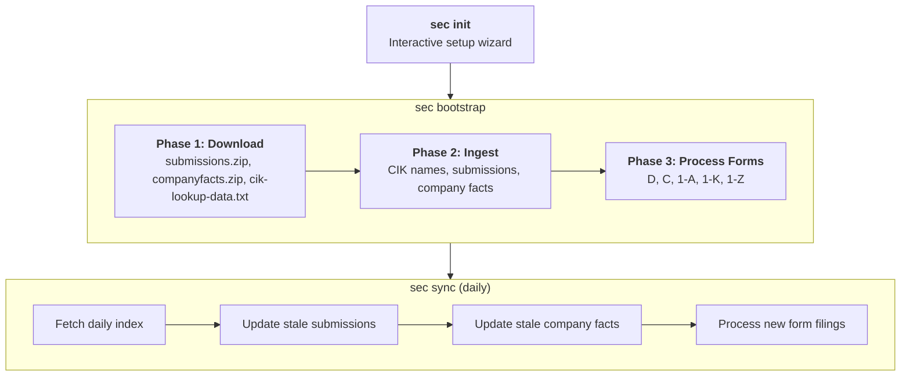
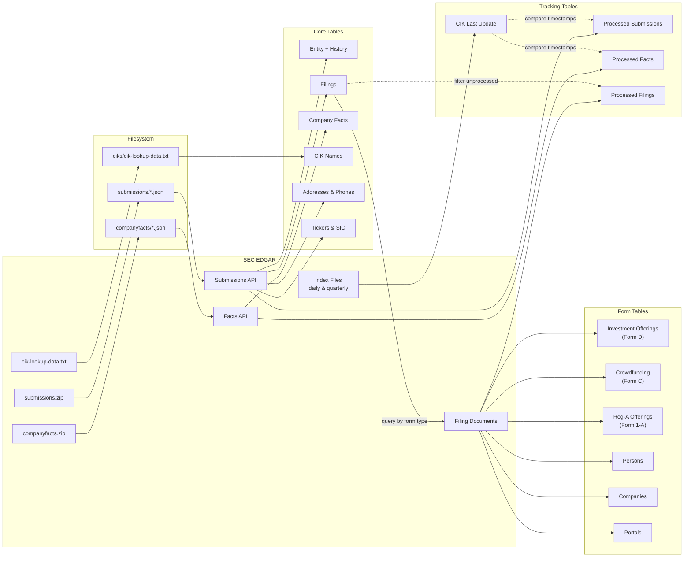

# @workglow/sec — CLI Specification

A CLI tool for retrieving and storing SEC EDGAR filing data into a local SQLite database. Fetches company identifiers, filing indexes, submissions, XBRL facts, and parses individual form types (Form D, Form C, Form 1-A, etc.) into normalized relational data.

**Runtime:** Bun **CLI Framework:** Commander.js **Database:** SQLite (single file) or Postgres (network)

---

## 0. Data Pipeline Overview

### 0.1 Operational Workflow

Shows the typical order of operations: interactive setup, bulk bootstrap, then daily sync.



### 0.2 Data Flow

Shows how data flows from SEC EDGAR through commands into database tables, and what each command reads vs. writes.



### 0.3 Command → Data Mapping

| Command                  | Reads                          | Writes                                                                                                             |
| ------------------------ | ------------------------------ | ------------------------------------------------------------------------------------------------------------------ |
| `sec bootstrap download` | SEC bulk archives              | Raw files (filesystem)                                                                                             |
| `sec bootstrap ingest`   | Raw files (filesystem)         | CIK Names, Entity, Filings, Addresses, Phones, Tickers, SIC, Company Facts, Processed Submissions, Processed Facts |
| `sec bootstrap`          | Raw files + SEC APIs           | All core + form tables                                                                                             |
| `sec sync`               | SEC daily index + APIs         | CIK Last Update, Entity, Filings, Company Facts, Form tables, SPAC candidates                                      |
| `sec fetch submissions`  | SEC submissions API            | Entity, Filings, Addresses, Phones, Tickers, SIC, Processed Submissions                                            |
| `sec fetch facts`        | SEC facts API                  | Company Facts, Processed Facts                                                                                     |
| `sec fetch form`         | Filings table, SEC filing docs | Form-specific tables, Processed Filings                                                                            |
| `sec fetch doc`          | SEC filing document            | Form-specific tables                                                                                               |
| `sec query *`            | Database tables                | _(read-only)_                                                                                                      |

---

## 1. CLI Commands

### 1.1 Global Options

All commands accept the following flags:

| Flag            | Short | Description                                         |
| --------------- | ----- | --------------------------------------------------- |
| `--json`        |       | Output structured JSON to stdout                    |
| `--verbose`     |       | Enable detailed log output                          |
| `--dry-run`     |       | Show what would be done without making changes      |
| `--no-color`    |       | Disable colored output                              |
| `--concurrency` |       | Max parallel operations (default varies by command) |

---

### 1.2 Setup

#### `sec init`

Interactive setup wizard. Prompts for configuration values and writes `.env.local`.

**Behavior:**

1. Prompts for `SEC_RAW_DATA_FOLDER` (where to store downloaded bulk data)
2. Prompts for database type (`sqlite` or `postgres`)
3. If SQLite: prompts for `SEC_DB_FOLDER` and `SEC_DB_NAME`
4. If Postgres: prompts for connection details (`SEC_PG_URL` or individual host/port/user/password/database)
5. Writes answers to `.env.local`
6. Runs `sec db setup` to create tables and indexes

---

### 1.3 Pipeline Commands

High-level commands that orchestrate multiple steps.

#### `sec bootstrap`

Run the full bootstrap pipeline: download, ingest, and process forms.

**Behavior:**

1. **Phase 1 — Download:** Downloads `submissions.zip`, `companyfacts.zip`, and `cik-lookup-data.txt` to `SEC_RAW_DATA_FOLDER`
2. **Phase 2 — Ingest:** Processes CIK names, submissions, and company facts from downloaded files
3. **Phase 3 — Process Forms:** Parses all supported form types (D, C, 1-A, 1-K, 1-Z) from ingested filings

Each phase runs to completion before the next begins. Progress is tracked so the command can be re-run to resume after interruption.

#### `sec sync`

Bring local SEC data forward to today. `sync` is a **command group** — bare `sec sync` prints help (there is no default subcommand).

**Leaves** (each is `sec sync <leaf>`):

| Leaf            | Steps (`--step`)       | What it runs                                                                                                                    |
| --------------- | ---------------------- | ------------------------------------------------------------------------------------------------------------------------------- |
| `submissions`   | `index`, `submissions` | Daily-index catch-up + lookback, then submissions refresh                                                                       |
| `facts`         | (single)               | Company-facts refresh                                                                                                           |
| `portals`       | (single)               | Forms sweep: CFPORTAL family                                                                                                    |
| `crowdfunding`  | (single)               | Forms sweep: Form C family                                                                                                      |
| `reg-a`         | (single)               | Forms sweep: Reg A family                                                                                                       |
| `forms <types>` | (single)               | Generic forms sweep (comma-separated types). Not in `all`. Extractor ids expand (`D` → `D,D/A`)                                 |
| `spacs`         | `identify`, `process`  | SPAC candidate identification, then SPAC-chain forms for known SPACs ∪ high/medium candidates                                   |
| `documents`     | `convert`              | Convert filing primary documents to markdown sections (`filing_document` + `filing_section`)                                    |
| `all`           | (none)                 | Every leaf with `inAll: true`, in order: `submissions` → `facts` → `portals` → `crowdfunding` → `reg-a` → `spacs` → `documents` |

**Common flags:**

| Flag              | Leaves                                               | Description                                                                                                                                                                |
| ----------------- | ---------------------------------------------------- | -------------------------------------------------------------------------------------------------------------------------------------------------------------------------- |
| `--step <name>`   | Multi-step leaves only                               | Run one step (`index` / `submissions` on `submissions`; `identify` / `process` on `spacs`). Unknown name errors with the valid list                                        |
| `--from <date>`   | `submissions`, `all`                                 | Exclusive daily-index catch-up start (`YYYY-MM-DD`); fetch begins the day after this date, like the cursor's `last_success`                                                |
| `--lookback <n>`  | `submissions`, `all`                                 | Re-fetch the last _n_ **completed** calendar days, bypassing cache (default **3**)                                                                                         |
| `--force`         | `submissions`, `facts`, `documents`, `all`           | Reprocess submissions/facts, ignoring processed state (`--force` on `submissions` applies to the `submissions` step; on `documents` it re-converts at the current version) |
| `--retry-failed`  | `facts`, `all`                                       | Also re-fetch CIKs whose last facts processing failed                                                                                                                      |
| `--full`          | `spacs`                                              | Rescan every entity on the `identify` step (default is incremental)                                                                                                        |
| `--shard <i/N>`   | `portals`, `crowdfunding`, `reg-a`, `spacs`, `forms` | Process shard _i_ of _N_ (1-based)                                                                                                                                         |
| `--types <list>`  | `documents`                                          | Narrow the forms converted (comma-separated); default is the narrative set in `CONVERTIBLE_FORMS`                                                                          |
| `--since <date>`  | `documents`                                          | Only convert filings filed on or after this date (`YYYY-MM-DD`)                                                                                                            |
| `--cik <cik>`     | `documents`                                          | Convert only this issuer's filings — the follow-up to `spac process <cik>`, since an unfiltered sweep works newest-first across every filer                                |
| `--limit <n>`     | `documents`                                          | Filings converted in one run (default **500**)                                                                                                                             |
| `--all-8k`        | `documents`                                          | Convert 8-Ks from every filer; the default takes one only when its CIK is in `spac`                                                                                        |
| `--download-only` | `documents`                                          | Fetch the selected filings into the accession-doc cache and stop — no parsing, no rows                                                                                     |

**Daily path:** `sec sync all` (or `sec sync submissions` then other leaves as needed).

**Daily-index cursor** (`index` step on `submissions`):

- All dates use the **America/New_York** calendar (“today” is the current ET date).
- **Today is never complete** — fetch today's `master.idx` when it exists, but never set `last_success` to today (EDGAR may still be appending).
- **Lookback:** always re-download the last `--lookback` (default 3) completed days, bypassing the file cache (yesterday's “today” copy may be partial).
- **Catch-up:** walk any gap from `last_success` through yesterday that lookback does not already cover.
- **404 on a completed day** (weekend/holiday): advance `last_success` through that day; no CIKs.
- **404 on today:** end the index step successfully; cursor unchanged.
- **Throw** (5xx/network): fail the index step; cursor unchanged.
- First run with an empty cursor seeds from `max(cik_last_update)` if present, else today.
- Catch-up walks `(start, today)` — the day after `start` through yesterday — so `--from` and `last_success` are **exclusive** (a `--from` of `2026-08-01` fetches from `2026-08-02` onward).

**Upgrade:** on an existing deployment, run `sec db setup` once before the first `sec sync` so the `daily_index_cursor` table exists.

`sync submissions --step submissions` is the submissions refresh **without** the index step (the old `update submissions` path).

Form-domain leaves do not refresh submissions first — run `sync submissions` (or `sync all`) before them when filings may be stale.

**`documents`** converts a filing's narrative documents to markdown and stores them as
`filing_section` rows (one per heading, flat, concatenating back to the document in `ordinal` order)
under one `filing_document` header row per document.

A submission is a **directory**, not a file: the primary document plus the exhibits filed with it.
An 8-K's primary document is routinely four sentences pointing at the EX-99.1 press release that
carries the news, so the converter stores every member whose body is prose — graphics, the XBRL
payload and the fee exhibit are skipped — and marks the primary with `is_primary`. That flag is what
a URL with no document segment resolves to, and it is written LAST: its presence means every
document behind it already landed, which is what makes an interrupted run resumable rather than
silently half-stored.

Because only the full-submission `<accession>.txt` carries the sibling `<DOCUMENT>` blocks, it is
now the first file tried for every form, with the bare primary document as a fallback for filings an
older route cached that way.

Selection is an anti-join against the stored `converter_version` on the PRIMARY row, so the leaf is
resumable and bounded at 500 filings per run — a backfill is many runs, not one. It reads the
accession-doc fetch cache first and only reaches EDGAR on a miss, and it runs LAST in `sync all` so
the documents it wants are already cached by the sweeps before it.

**One issuer, end to end.** To get a single SPAC's filings — and their readable text — into the
database:

```sh
sec fetch submissions 1811882     # filings, entity, tickers, addresses for that CIK
sec spac process 1811882          # replay its filings in date order: extraction, timeline, events
sec sync documents --cik 1811882  # convert those filings to markdown sections
```

The first creates the `filings` rows the other two select from; without it they have nothing to
find. `spac process` is incremental — a filing with a recorded successful run is skipped — so
re-running is cheap, and `--force` is what rebuilds.

Scoped to the narrative forms (registrations, prospectuses, merger proxies, 8-Ks) rather than to
every filing: `filings` is hundreds of thousands of rows, most of them ownership XML with no prose.
Widen it with `--types`, or by adding to `CONVERTIBLE_FORMS` and re-running. Bump
`FILING_CONVERTER_VERSION` and re-run to re-convert after a parser change — never truncate, since a
half-finished re-run then leaves the old rows readable.

**8-Ks are further scoped to known SPACs.** They are in `CONVERTIBLE_FORMS` because the SPAC
lifecycle is built out of them — the LOI, the definitive agreement, the redemption, the closing —
but every reporting company files one on every earnings release and every material event, and
unfiltered they outnumber the rest of the convertible set by more than an order of magnitude. So the
default sweep takes an 8-K only when its filer appears in `spac`, matching either `cik` or
`current_cik` (a combination that moves the reporting entity files its closing 8-K under the new
one). `--all-8k` converts them for every filer.

**`--download-only` splits the leaf in half.** It runs the same selection and the same fetch,
then stops: no parse, no rows. The two halves have very different costs — the download is
metered by EDGAR at 4 requests/second and runs for hours, the conversion is local and runs for
minutes — so separating them lets the slow half run unattended and the fast half be re-run
freely after a `FILING_CONVERTER_VERSION` bump.

Nothing records that a filing was downloaded; the cache file IS the record. A `--download-only`
run therefore re-selects the same filings on a re-run and serves them from disk, touching no
network, and the conversion sweep that follows makes no requests at all. The run reports
`downloaded` (fetched this run) and `cached` (already on disk) separately — a conversion sweep
reports them too, which is what distinguishes a run that is slow because of EDGAR from one that
is slow because of the parser.

The gate reads `spac`, the **known-SPAC** table written by `spac process` — not the
`spac_candidate` screen, which is a guess, and this is the expensive half of the work. A deployment
that has ingested submissions but not yet run `sec sync spacs` therefore has an empty `spac` table
and converts **no** 8-Ks: run the SPAC leaf first, or pass `--all-8k`.

---

### 1.4 Bootstrap (Granular)

Subcommands for running individual bootstrap phases.

#### `sec bootstrap download`

Download and extract bulk SEC data archives.

| Argument | Description                                                    |
| -------- | -------------------------------------------------------------- |
| `<type>` | One of: `submissions`, `facts`, `ciks`, `all` (default: `all`) |

**Behavior:**

- `submissions` — Downloads `submissions.zip`, extracts to `SEC_RAW_DATA_FOLDER/submissions/`
- `facts` — Downloads `companyfacts.zip`, extracts to `SEC_RAW_DATA_FOLDER/facts/`
- `ciks` — Downloads `cik-lookup-data.txt` to `SEC_RAW_DATA_FOLDER/ciks/`
- `all` — Downloads all three
- Validates extracted paths to prevent directory traversal

#### `sec bootstrap ingest`

Process downloaded bulk files into the database.

| Option   | Description                                                        |
| -------- | ------------------------------------------------------------------ |
| `--type` | One of: `ciknames`, `submissions`, `facts`, `all` (default: `all`) |

**Behavior:**

- `ciknames` — Parses `cik-lookup-data.txt` (colon-delimited `name:cik:`) and stores CIK-name pairs
- `submissions` — Scans `CIK{padded}.json` files, skips already-processed, stores entity + filing data
- `facts` — Scans `CIK{padded}.json` fact files, skips already-processed, stores linearized XBRL facts
- `all` — Runs all three in sequence

---

### 1.5 Fetch Commands

Low-level commands to fetch and store data for individual entities.

#### `sec fetch submissions <cik>`

Fetch and store all submission data for a single company.

| Argument | Required | Description                 |
| -------- | -------- | --------------------------- |
| `cik`    | Yes      | Central Index Key (numeric) |

| Option          | Description                            |
| --------------- | -------------------------------------- |
| `--date <date>` | Cache-busting date (defaults to today) |

**Behavior:**

1. Fetches main submission JSON from `https://data.sec.gov/submissions/CIK{cik-padded}.json`
2. If the response includes additional filing batch files, fetches each one
3. Combines all filing records
4. Stores in parallel:
   - Entity metadata (name, type, SIC, EIN, website, category, fiscal year, state of incorporation)
   - Contact info (mailing and business addresses, phone numbers)
   - SIC code description
   - Ticker-exchange pairs
   - All filing records
5. Marks CIK as processed with current timestamp

#### `sec fetch facts <cik>`

Fetch and store XBRL financial facts for a single company.

| Argument | Required | Description                 |
| -------- | -------- | --------------------------- |
| `cik`    | Yes      | Central Index Key (numeric) |

| Option          | Description   |
| --------------- | ------------- |
| `--date <date>` | Specific date |

**Behavior:**

1. Fetches from `https://data.sec.gov/api/xbrl/companyfacts/CIK{cik-padded}.json`
2. Linearizes the nested facts structure (taxonomy -> fact name -> unit -> data points) into flat records
3. Stores in batches of 1,000 records
4. Marks CIK facts as processed

#### `sec fetch form <cik> <form> [accession]`

Parse and store specific form filings for a company.

| Argument    | Required | Description                          |
| ----------- | -------- | ------------------------------------ |
| `cik`       | Yes      | Central Index Key                    |
| `form`      | Yes      | Form type (e.g., `D`, `C`, `1-A`)    |
| `accession` | No       | Specific accession number to process |

**Behavior:**

- Queries the filings table for matching CIK + form type
- If `accession` provided, filters to that specific accession number
- For each filing: fetches the primary document and parses it using the appropriate form parser
- Stores extracted data and marks the filing as processed

#### `sec fetch doc <accession> [fileName]`

Process a single accession document.

| Argument    | Required | Description                         |
| ----------- | -------- | ----------------------------------- |
| `accession` | Yes      | Accession number                    |
| `fileName`  | No       | Specific filename within the filing |

**Behavior:**

- Fetches the document from `https://www.sec.gov/Archives/edgar/data/{cik}/{accession}/{fileName}`
- Routes to the appropriate form parser based on form type
- Stores extracted data

---

### 1.7 Query Commands

Read-only commands for querying the database. All query commands support `--format` (`table`, `csv`, `json`; default: `table`) and `--limit`/`--offset` for pagination.

#### `sec query entities [search]`

List or look up entities.

| Argument | Required | Description                              |
| -------- | -------- | ---------------------------------------- |
| `search` | No       | Free-text search term to filter entities |

| Option           | Description                      |
| ---------------- | -------------------------------- |
| `--cik <cik>`    | Filter by exact CIK              |
| `--sic <code>`   | Filter by SIC code               |
| `--state <code>` | Filter by state of incorporation |
| `--sort <field>` | Sort by field name               |
| `--limit <n>`    | Max rows (default: 25)           |
| `--offset <n>`   | Skip rows (default: 0)           |
| `--format <fmt>` | Output format: table, csv, json  |

#### `sec query filings [search]`

List or look up filings.

| Argument | Required | Description                             |
| -------- | -------- | --------------------------------------- |
| `search` | No       | Free-text search term to filter filings |

| Option            | Description                     |
| ----------------- | ------------------------------- |
| `--cik <cik>`     | Filter by entity CIK            |
| `--form <type>`   | Filter by form type             |
| `--after <date>`  | Filing date start (YYYY-MM-DD)  |
| `--before <date>` | Filing date end (YYYY-MM-DD)    |
| `--limit <n>`     | Max rows (default: 25)          |
| `--offset <n>`    | Skip rows (default: 0)          |
| `--format <fmt>`  | Output format: table, csv, json |

#### `sec query offerings [search]`

List Form D investment offerings.

| Argument | Required | Description                               |
| -------- | -------- | ----------------------------------------- |
| `search` | No       | Free-text search term to filter offerings |

| Option               | Description                     |
| -------------------- | ------------------------------- |
| `--cik <cik>`        | Filter by issuer CIK            |
| `--industry <group>` | Filter by industry group        |
| `--exemption <type>` | Filter by exemption type        |
| `--after <date>`     | Filter after date               |
| `--before <date>`    | Filter before date              |
| `--limit <n>`        | Max rows (default: 25)          |
| `--offset <n>`       | Skip rows (default: 0)          |
| `--format <fmt>`     | Output format: table, csv, json |

#### `sec query crowdfunding [cik]`

List Regulation Crowdfunding (Form C) offerings.

| Argument | Required | Description          |
| -------- | -------- | -------------------- |
| `cik`    | No       | Filter by issuer CIK |

| Option           | Description                     |
| ---------------- | ------------------------------- |
| `--limit <n>`    | Max rows (default: 25)          |
| `--offset <n>`   | Skip rows (default: 0)          |
| `--format <fmt>` | Output format: table, csv, json |

#### `sec query facts <cik>`

List XBRL financial facts for a company.

| Argument | Required | Description                 |
| -------- | -------- | --------------------------- |
| `cik`    | Yes      | Central Index Key (numeric) |

| Option             | Description                     |
| ------------------ | ------------------------------- |
| `--name <pattern>` | Filter by fact name             |
| `--limit <n>`      | Max rows (default: 25)          |
| `--offset <n>`     | Skip rows (default: 0)          |
| `--format <fmt>`   | Output format: table, csv, json |

#### `sec query persons [cik]`

List persons extracted from form filings.

| Argument | Required | Description              |
| -------- | -------- | ------------------------ |
| `cik`    | No       | Filter by related entity |

| Option             | Description                     |
| ------------------ | ------------------------------- |
| `--name <pattern>` | Filter by person name           |
| `--limit <n>`      | Max rows (default: 25)          |
| `--offset <n>`     | Skip rows (default: 0)          |
| `--format <fmt>`   | Output format: table, csv, json |

---

### 1.8 Database Management

#### `sec db setup`

Create all database tables and indexes. Automatically run by `sec init`; can be run independently.

#### `sec db status`

Show database connection info and whether tables exist.

#### `sec db stats`

Show row counts for all tables and processing progress.

#### `sec db reset`

Drop all tables and re-create them. Prompts for confirmation unless `--confirm` is passed.

| Option      | Description              |
| ----------- | ------------------------ |
| `--confirm` | Skip confirmation prompt |

---

## 2. Data Model

### 2.1 Core Entities

#### Entity

The central record for any SEC-registered entity (company, fund, individual).

| Column                     | Type    | Constraints            | Description                        |
| -------------------------- | ------- | ---------------------- | ---------------------------------- |
| `cik`                      | Integer | **PK**, &gt;= 0        | Central Index Key                  |
| `name`                     | String  | nullable               | Entity name                        |
| `type`                     | String  | nullable               | Entity type                        |
| `sic`                      | Integer | 0–9999, nullable       | Standard Industrial Classification |
| `ein`                      | String  | max 10, nullable       | Employer Identification Number     |
| `description`              | String  | nullable               | Business description               |
| `website`                  | String  | nullable               | Company website                    |
| `investor_website`         | String  | nullable               | Investor relations website         |
| `category`                 | String  | nullable               | SEC category                       |
| `fiscal_year`              | String  | max 4 (MMDD), nullable | Fiscal year end                    |
| `state_incorporation`      | String  | max 2, nullable        | State code                         |
| `state_incorporation_desc` | String  | nullable               | State name                         |

#### Entity History

Tracks temporal changes to entity records.

| Column                 | Type     | Constraints | Description              |
| ---------------------- | -------- | ----------- | ------------------------ |
| `cik`                  | Integer  | **PK**      | Entity CIK               |
| `valid_from`           | DateTime | **PK**      | Version start            |
| `valid_to`             | DateTime | nullable    | Version end              |
| `change_source`        | String   |             | Source of change         |
| `change_date`          | DateTime |             | When recorded            |
| _(all Entity columns)_ |          |             | Snapshot of entity state |

#### Entity Ticker

Stock ticker symbols associated with entities.

| Column     | Type    | Constraints    | Description   |
| ---------- | ------- | -------------- | ------------- |
| `cik`      | Integer | **PK**         | Entity CIK    |
| `ticker`   | String  | **PK**, max 8  | Ticker symbol |
| `exchange` | String  | **PK**, max 20 | Exchange name |

#### SIC Code

Standard Industrial Classification codes.

| Column        | Type    | Constraints    | Description          |
| ------------- | ------- | -------------- | -------------------- |
| `sic`         | Integer | **PK**, 0–9999 | SIC code             |
| `description` | String  | nullable       | Industry description |

#### CIK Name

CIK-to-name lookup mappings.

| Column | Type    | Constraints | Description       |
| ------ | ------- | ----------- | ----------------- |
| `cik`  | Integer | **PK**      | Central Index Key |
| `name` | String  |             | Company name      |

---

### 2.2 Filing Data

#### Filing

Individual SEC filing records.

| Column                    | Type    | Constraints              | Description               |
| ------------------------- | ------- | ------------------------ | ------------------------- |
| `cik`                     | Integer | **PK**, indexed          | Entity CIK                |
| `accession_number`        | String  | **PK**, max 20, indexed  | Unique filing ID          |
| `filing_date`             | String  | YYYY-MM-DD, indexed      | Submission date           |
| `report_date`             | String  | YYYY-MM-DD, nullable     | Report period date        |
| `acceptance_date`         | String  | ISO 8601                 | SEC acceptance datetime   |
| `form`                    | String  | max 8, nullable, indexed | Form type                 |
| `file_number`             | String  | max 10, nullable         | SEC file number           |
| `film_number`             | String  | max 10, nullable         | Film number               |
| `primary_doc`             | String  | max 45                   | Primary document filename |
| `primary_doc_description` | String  | max 45, nullable         | Document description      |
| `size`                    | Integer | nullable                 | Filing size (bytes)       |
| `is_xbrl`                 | Boolean | nullable                 | Contains XBRL             |
| `is_inline_xbrl`          | Boolean | nullable                 | Contains inline XBRL      |
| `items`                   | String  | nullable                 | Items covered             |
| `act`                     | String  | max 2, nullable          | Act under which filed     |

#### Company Facts

Linearized XBRL financial data points.

| Column             | Type    | Constraints    | Description                      |
| ------------------ | ------- | -------------- | -------------------------------- |
| `cik`              | Integer | **PK**         | Entity CIK                       |
| `grouping`         | String  | **PK**, max 8  | Taxonomy grouping                |
| `name`             | String  | **PK**         | Fact name                        |
| `accession_number` | String  | **PK**, max 20 | Filing reference                 |
| `val_unit`         | String  | **PK**, max 12 | Value unit (USD, shares, etc.)   |
| `fy`               | Integer | **PK**         | Fiscal year                      |
| `fp`               | String  | **PK**, max 2  | Fiscal period                    |
| `val`              | Number  | **PK**         | Fact value                       |
| `filed_date`       | String  | YYYY-MM-DD     | Filing date                      |
| `form`             | String  | max 10         | Form type                        |
| `frame`            | String  | nullable       | Reporting frame (e.g., CY2023Q1) |
| `start_date`       | String  | nullable       | Period start                     |
| `end_date`         | String  | nullable       | Period end                       |

---

### 2.3 Contact Information

#### Address

Normalized address records, deduplicated by hash.

| Column             | Type   | Constraints | Description                   |
| ------------------ | ------ | ----------- | ----------------------------- |
| `address_hash_id`  | String | **PK**      | Deterministic hash of address |
| `street1`          | String |             | Line 1                        |
| `street2`          | String | nullable    | Line 2                        |
| `street3`          | String | nullable    | Line 3                        |
| `city`             | String | indexed     | City                          |
| `state_or_country` | String |             | State or country code         |
| `country_code`     | String |             | ISO country code              |
| `zip`              | String | nullable    | Postal code                   |

#### Address ↔ Entity Junction

| Column            | Type    | Constraints | Description                                     |
| ----------------- | ------- | ----------- | ----------------------------------------------- |
| `address_hash_id` | String  | **PK**      | Address reference                               |
| `relation_name`   | String  | **PK**      | Relationship type (e.g., "mailing", "business") |
| `cik`             | Integer | **PK**      | Entity CIK                                      |

#### Phone

Normalized phone records.

| Column                 | Type   | Constraints    | Description                               |
| ---------------------- | ------ | -------------- | ----------------------------------------- |
| `international_number` | String | **PK**, max 20 | International format                      |
| `country_code`         | String | max 2          | ISO country code                          |
| `type`                 | String | nullable       | fixed-line, mobile, voip, toll-free, etc. |
| `raw_phone`            | String |                | Original phone string                     |

#### Phone ↔ Entity Junction

| Column                 | Type    | Constraints | Description       |
| ---------------------- | ------- | ----------- | ----------------- |
| `international_number` | String  | **PK**      | Phone reference   |
| `relation_name`        | String  | **PK**      | Relationship type |
| `cik`                  | Integer | **PK**      | Entity CIK        |

---

### 2.4 Companies (from Form Filings)

Companies mentioned in filings (issuers, related parties) — distinct from entities registered with SEC.

#### Company

| Column            | Type    | Constraints | Description                |
| ----------------- | ------- | ----------- | -------------------------- |
| `company_hash_id` | String  | **PK**      | Deterministic hash of name |
| `company_name`    | String  |             | Official name              |
| `country_code`    | String  | nullable    | Country                    |
| `suffix`          | String  | nullable    | Inc., LLC, Corp., etc.     |
| `cik`             | Integer | nullable    | CIK if SEC-registered      |
| `crd`             | String  | nullable    | FINRA CRD number           |

#### Company ↔ Entity Junction

| Column            | Type       | Constraints    | Description                                               |
| ----------------- | ---------- | -------------- | --------------------------------------------------------- |
| `company_hash_id` | String     | **PK**         | Company reference                                         |
| `relation_name`   | String     | **PK**, max 50 | e.g., "form-d:primary-issuer", "form-d:additional-issuer" |
| `cik`             | Integer    | **PK**         | Entity CIK                                                |
| `titles`          | String\[\] |                | Relationship types                                        |

#### Company ↔ Address Junction

| Column            | Type   | Constraints | Description       |
| ----------------- | ------ | ----------- | ----------------- |
| `company_hash_id` | String | **PK**      | Company reference |
| `relation_name`   | String | **PK**      | Relationship type |
| `address_hash_id` | String | **PK**      | Address reference |

#### Company ↔ Phone Junction

| Column                 | Type   | Constraints | Description       |
| ---------------------- | ------ | ----------- | ----------------- |
| `company_hash_id`      | String | **PK**      | Company reference |
| `relation_name`        | String | **PK**      | Relationship type |
| `international_number` | String | **PK**      | Phone reference   |

#### Company Previous Names

| Column            | Type   | Constraints | Description                       |
| ----------------- | ------ | ----------- | --------------------------------- |
| `company_hash_id` | String | **PK**      | Company reference                 |
| `previous_name`   | String | **PK**      | Historical name                   |
| `name_type`       | String | **PK**      | "issuer", "edgar", "dba", "other" |
| `date_changed`    | Date   | nullable    | When changed                      |
| `source`          | String | nullable    | Source of info                    |

---

### 2.5 Persons (from Form Filings)

Directors, officers, and related persons extracted from forms.

#### Person

| Column           | Type    | Constraints | Description                  |
| ---------------- | ------- | ----------- | ---------------------------- |
| `person_hash_id` | String  | **PK**      | Deterministic hash           |
| `first`          | String  |             | First name                   |
| `middle`         | String  | nullable    | Middle name/initial          |
| `last`           | String  |             | Last name                    |
| `suffix`         | String  | nullable    | Jr., Sr., III, etc.          |
| `title`          | String  | nullable    | Professional title           |
| `nick`           | String  | nullable    | Nickname                     |
| `dob`            | String  | nullable    | YYYY-MM-DD, YYYY-MM, or YYYY |
| `notes`          | String  | nullable    | Distinguishing notes         |
| `cik`            | Integer | nullable    | CIK if registered            |
| `crd`            | String  | nullable    | FINRA CRD number             |

#### Person ↔ Entity Junction

| Column           | Type       | Constraints | Description                     |
| ---------------- | ---------- | ----------- | ------------------------------- |
| `person_hash_id` | String     | **PK**      | Person reference                |
| `relation_name`  | String     | **PK**      | e.g., "form-d:related-person"   |
| `cik`            | Integer    | **PK**      | Entity CIK                      |
| `titles`         | String\[\] |             | Roles (Director, Officer, etc.) |

#### Person ↔ Address Junction

| Column            | Type   | Constraints | Description       |
| ----------------- | ------ | ----------- | ----------------- |
| `person_hash_id`  | String | **PK**      | Person reference  |
| `relation_name`   | String | **PK**      | Relationship type |
| `address_hash_id` | String | **PK**      | Address reference |

#### Person ↔ Phone Junction

| Column                 | Type   | Constraints | Description       |
| ---------------------- | ------ | ----------- | ----------------- |
| `person_hash_id`       | String | **PK**      | Person reference  |
| `relation_name`        | String | **PK**      | Relationship type |
| `international_number` | String | **PK**      | Phone reference   |

#### Person Previous Names

| Column           | Type   | Constraints | Description                          |
| ---------------- | ------ | ----------- | ------------------------------------ |
| `person_hash_id` | String | **PK**      | Person reference                     |
| `previous_name`  | String | **PK**      | Former name                          |
| `name_type`      | String | **PK**      | "maiden", "former", "alias", "other" |
| `date_changed`   | Date   | nullable    | When changed                         |
| `source`         | String | nullable    | Source of info                       |

---

### 2.6 Investment Offerings (Form D)

#### Investment Offering

| Column                         | Type       | Constraints      | Description                |
| ------------------------------ | ---------- | ---------------- | -------------------------- |
| `cik`                          | Integer    | **PK**           | Issuer CIK                 |
| `file_number`                  | String     | **PK**, max 10   | SEC file number            |
| `industry_group`               | String     | max 25           | Industry classification    |
| `industry_subgroup`            | String     | max 25, nullable | Subgroup                   |
| `date_of_first_sale`           | Date       | nullable         | First sale date            |
| `exemptions`                   | String\[\] | nullable         | Federal exemptions claimed |
| `is_debt_type`                 | Boolean    | nullable         | Debt securities            |
| `is_equity_type`               | Boolean    | nullable         | Equity securities          |
| `is_mineral_property_type`     | Boolean    | nullable         | Mineral property           |
| `is_option_to_aquire_type`     | Boolean    | nullable         | Options                    |
| `is_pooled_investment_type`    | Boolean    | nullable         | Pooled investment          |
| `is_security_to_be_aquired`    | Boolean    | nullable         | Securities to be acquired  |
| `is_tenant_in_common`          | Boolean    | nullable         | TIC interests              |
| `is_business_combination_type` | Boolean    | nullable         | Business combination       |
| `is_other_type`                | Boolean    | nullable         | Other types                |
| `description_of_other`         | String     | nullable         | Other type description     |

#### Investment Offering History

| Column                          | Type    | Constraints | Description             |
| ------------------------------- | ------- | ----------- | ----------------------- |
| `cik`                           | Integer | **PK**      | Issuer CIK              |
| `file_number`                   | String  | **PK**      | SEC file number         |
| `accession_number`              | String  | **PK**      | Filing reference        |
| _(snapshot of offering fields)_ |         |             | State at time of filing |

---

### 2.7 Regulation A Offerings (Form 1-A)

#### Reg-A Offering

| Column                             | Type    | Constraints       | Description              |
| ---------------------------------- | ------- | ----------------- | ------------------------ |
| `cik`                              | Integer | **PK**            | Issuer CIK               |
| `file_number`                      | String  | **PK**, max 17    | SEC file number          |
| `issuer_name`                      | String  | max 150, nullable | Issuer name              |
| `jurisdiction`                     | String  | max 10, nullable  | State/country            |
| `sic_code`                         | Integer | nullable          | SIC code                 |
| `tier`                             | String  | max 10, nullable  | "Tier1" or "Tier2"       |
| `financial_statement_audit_status` | String  | max 20, nullable  | Audited/Unaudited        |
| `securities_offered_type`          | String  | max 100, nullable | Type of securities       |
| `industry_group`                   | String  | max 25, nullable  | Industry                 |
| `status`                           | String  | max 20            | pending, reporting, exit |

#### Reg-A Equity Class

Per-offering equity class records (common and preferred).

#### Reg-A Financial Data

Per-offering financial data (assets, liabilities, revenue, etc.).

#### Reg-A Service Provider

Per-offering service providers (underwriters, auditors, legal, etc.).

---

### 2.8 Crowdfunding (Form C)

#### Crowdfunding Entity

| Column               | Type    | Constraints    | Description        |
| -------------------- | ------- | -------------- | ------------------ |
| `cik`                | Integer | **PK**         | Issuer CIK         |
| `file_number`        | String  | **PK**, max 10 | File number        |
| `filing_date`        | Date    |                | Filing date        |
| `name`               | String  | max 140        | Entity name        |
| `legal_status`       | String  | max 50         | Legal form         |
| `state_jurisdiction` | String  | max 2          | State code         |
| `date_incorporation` | Date    |                | Incorporation date |
| `url`                | String  | max 255        | Entity website     |
| `portal_cik`         | Integer |                | Funding portal CIK |
| `status`             | String  | max 20         | Status             |

#### Crowdfunding Offering

| Column                        | Type    | Constraints | Description          |
| ----------------------------- | ------- | ----------- | -------------------- |
| `cik`                         | Integer | **PK**      | Issuer CIK           |
| `file_number`                 | String  | **PK**      | File number          |
| `filing_date`                 | Date    | **PK**      | Filing date          |
| `compensation_amount_percent` | Number  | 0–1         | Compensation %       |
| `financial_interest_percent`  | Number  | 0–1         | Financial interest % |
| `security_offered_type`       | String  |             | Security type        |
| `no_of_security_offered`      | Integer |             | Number offered       |
| `price`                       | Number  |             | Price per security   |
| `offering_amount`             | Number  |             | Total offering       |
| `maximum_offering_amount`     | Number  |             | Maximum amount       |
| `over_subscription_accepted`  | String  |             | Y/N                  |
| `deadline_date`               | Date    |             | Campaign deadline    |

#### Crowdfunding Report

| Column            | Type    | Constraints | Description           |
| ----------------- | ------- | ----------- | --------------------- |
| `cik`             | Integer | **PK**      | Issuer CIK            |
| `file_number`     | String  | **PK**      | File number           |
| `filing_date`     | Date    | **PK**      | Filing date           |
| `disclosure_name` | String  | **PK**      | Disclosure identifier |

#### Portal

| Column  | Type    | Constraints | Description   |
| ------- | ------- | ----------- | ------------- |
| `cik`   | Integer | **PK**      | Portal CIK    |
| `name`  | String  |             | Portal name   |
| `brand` | String  |             | Brand name    |
| `url`   | String  |             | Website URL   |
| `live`  | Boolean |             | Active status |

---

### 2.9 Processing Tracking

These tables track what has been fetched/processed to support incremental updates.

#### CIK Last Update

| Column        | Type    | Constraints | Description            |
| ------------- | ------- | ----------- | ---------------------- |
| `cik`         | Integer | **PK**      | Entity CIK             |
| `last_update` | String  | YYYY-MM-DD  | Last known filing date |

#### Processed Submissions

| Column           | Type    | Constraints | Description         |
| ---------------- | ------- | ----------- | ------------------- |
| `cik`            | Integer | **PK**      | Entity CIK          |
| `last_processed` | String  | YYYY-MM-DD  | When last processed |

#### Processed Facts

| Column           | Type    | Constraints | Description         |
| ---------------- | ------- | ----------- | ------------------- |
| `cik`            | Integer | **PK**      | Entity CIK          |
| `last_processed` | String  | YYYY-MM-DD  | When last processed |

#### Processed Filings

| Column             | Type    | Constraints    | Description                  |
| ------------------ | ------- | -------------- | ---------------------------- |
| `cik`              | Integer | **PK**         | Entity CIK                   |
| `accession_number` | String  | **PK**, max 20 | Filing ID                    |
| `form`             | String  | max 8          | Form type                    |
| `last_processed`   | String  | YYYY-MM-DD     | When last processed          |
| `success`          | Boolean |                | Whether processing succeeded |

#### Change Log

Audit log of data changes.

---

## 3. SEC EDGAR APIs

All requests include a User-Agent header identifying the client. Rate limited to 10 requests/second with exponential backoff (1s initial, 2x multiplier, 60s max).

### 3.1 Endpoints Used

| Endpoint                                                                           | Description                                    |
| ---------------------------------------------------------------------------------- | ---------------------------------------------- |
| `https://www.sec.gov/Archives/edgar/cik-lookup-data.txt`                           | All CIK-to-name mappings                       |
| `https://data.sec.gov/submissions/CIK{cik}.json`                                   | Company submission metadata and filing history |
| `https://data.sec.gov/api/xbrl/companyfacts/CIK{cik}.json`                         | XBRL financial facts                           |
| `https://www.sec.gov/Archives/edgar/daily-index/{year}/QTR{q}/master.{YYMMDD}.idx` | Daily filing index                             |
| `https://www.sec.gov/Archives/edgar/full-index/{year}/QTR{q}/master.idx`           | Quarterly filing index                         |
| `https://www.sec.gov/Archives/edgar/data/{cik}/{accession}/{filename}`             | Individual filing documents                    |
| `https://www.sec.gov/Archives/edgar/daily-index/bulkdata/submissions.zip`          | Bulk submissions archive                       |
| `https://www.sec.gov/Archives/edgar/daily-index/xbrl/companyfacts.zip`             | Bulk company facts archive                     |

### 3.2 Submission Response Shape

The submissions endpoint returns:

- Entity metadata (name, CIK, type, SIC, EIN, addresses, phones, tickers, exchanges, former names)
- `filings.recent`: Array of recent filing records (accession number, date, form, document, size, etc.)
- `filings.files`: Array of additional filing batch files to fetch (for companies with many filings)

### 3.3 Company Facts Response Shape

Nested structure: `facts → {taxonomy} → {factName} → {unit} → [data points]`

Each data point contains: `val`, `accn`, `fy`, `fp`, `form`, `filed`, `frame`, `start`, `end`

Taxonomies include: `us-gaap`, `dei`, `ifrs-full`, `srt`, etc.

### 3.4 Index File Format

Pipe-delimited text with header, containing: `CIK|Company Name|Form Type|Date Filed|Filename`

---

## 4. Form Parsers

### 4.1 Form D / D-A (Regulation D)

Private placement filings. Parsed from XML.

**Extracted data:**

- Primary issuer: CIK, name, address, phone, entity type, year of incorporation, previous names
- Additional issuers (up to 99): Same fields
- Related persons (up to 100): Name, address, relationship types (Executive Officer, Director, Promoter, etc.)
- Offering data: Industry group (12 categories), fund info, issuer size, federal exemptions, duration, security types, minimum investment, sales compensation recipients, offering amounts, investor counts, use of proceeds
- Signatures (up to 101)

**Storage mapping:**

- Issuers → Company records with relation `form-d:primary-issuer` / `form-d:additional-issuer`
- Related persons → Person or Company records with relation `form-d:related-person`
- Sales compensation → Company records with relation `form-d:sales-compensation`
- Offering → Investment Offering + Investment Offering History records
- Signers → Person records with relation `form-d:signature`

### 4.2 Form C Variants (Regulation Crowdfunding)

Submission types: C, C-W, C-U, C-U-W, C/A, C/A-W, C-AR, C-AR-W, C-AR/A, C-AR/A-W, C-TR, C-TR-W

**Extracted data:**

- Issuer info: Name, legal status, jurisdiction, incorporation date, address, website
- Co-issuers (up to 50)
- Offering info: Compensation, financial interest, security type, count, price, amounts, deadline
- Annual report disclosures: Two years of financial data (employees, assets, liabilities, revenue, net income)
- Portal CIK and CRD
- Signatures

**Storage mapping:**

- Issuer → Crowdfunding Entity record
- Offering → Crowdfunding Offering record
- Disclosures → Crowdfunding Report records
- Portal → Portal record

### 4.3 Form 1-A / 1-A/A / DOS / DOS/A / 1-A POS (Regulation A)

Mini-IPO filings.

**Extracted data:**

- Issuer employees info (up to 15 issuers): Name, jurisdiction, year incorporated, CIK, SIC, IRS number, employee counts
- Issuer info: Address, phone, industry group, financial data (cash, assets, liabilities, revenue, net income)
- Securities info: Common equity classes, preferred equity classes, debt securities (each up to 10), with outstanding amounts and CUSIP
- Summary: Tier 1/2 designation, audit status, security types offered, service provider fees
- Jurisdictions where offered

**Storage mapping:**

- Issuer → Reg-A Offering record
- Financial data → Reg-A Financial Data records
- Equity classes → Reg-A Equity Class records
- Service providers → Reg-A Service Provider records

### 4.4 Form 1-K (Regulation A Annual Report)

Annual reporting for Reg A issuers. Similar structure to 1-A with updated financial data.

### 4.5 Form 1-Z / 1-Z/A (Regulation A Termination)

Exit/termination filings for Reg A offerings. Updates offering status to "exit".

---

## 5. Normalization

### 5.1 Company Name Normalization

- Removes common suffixes (Inc., LLC, Corp., Ltd., L.P., etc.)
- Normalizes spacing and casing
- Generates deterministic hash ID for deduplication

### 5.2 Address Normalization

- Normalizes city names (uppercase)
- Infers country codes from state codes
- Generates deterministic hash for deduplication

### 5.3 Phone Normalization

- Converts to international format with country code
- Classifies type (fixed-line, mobile, VOIP, toll-free, etc.)
- Uses awesome-phonenumber library

### 5.4 Person Name Parsing

- Parses full names into first/middle/last/suffix components
- Generates deterministic hash for deduplication

---

## 6. Environment Variables

| Variable              | Required               | Description                           |
| --------------------- | ---------------------- | ------------------------------------- |
| `SEC_RAW_DATA_FOLDER` | For bootstrap commands | Path to downloaded raw SEC data       |
| `SEC_DB_FOLDER`       | Yes                    | Path to SQLite database directory     |
| `SEC_DB_NAME`         | No (default: `edgar`)  | Database filename (without extension) |

---

## 7. Database Configuration

Single SQLite file with these performance pragmas:

- `synchronous = 0` — Async writes (fastest, risk of corruption on crash)
- `cache_size = 1000000` — \~4GB page cache
- `locking_mode = EXCLUSIVE` — Single-writer, no concurrent access
- `temp_store = MEMORY` — RAM-based temp tables
- `journal_mode = OFF` — No journaling (fastest writes, no crash recovery)

These settings optimize for bulk data ingestion, not concurrent access.

---

## 8. Output Behavior

### 8.1 TTY Detection

- **Interactive terminal (TTY):** Rich output including spinners, progress bars, colored text, and formatted tables.
- **Piped / non-interactive:** Plain text output without ANSI escape codes, spinners, or progress bars. Suitable for scripting and log files.

### 8.2 JSON Mode

The `--json` flag forces structured JSON output to stdout for all commands. When active:

- Pipeline commands (`bootstrap`, `sync`) emit a JSON summary on completion with counts of processed items and any errors.
- Fetch commands emit the stored record(s) as JSON.
- Query commands emit a JSON array of matching records.
- Database management commands emit a JSON object with status/stats.
- Progress and status messages are suppressed from stdout (errors still go to stderr).

### 8.3 Verbose Mode

The `--verbose` flag adds detailed log output including:

- Individual fetch URLs and response status codes
- Per-record processing details
- Timing information for each phase

Verbose output goes to stderr so it does not interfere with `--json` on stdout.

### 8.4 Query Output Formats

Query commands (`sec query *`) support three output formats via `--format`:

| Format  | Description                                                 |
| ------- | ----------------------------------------------------------- |
| `table` | Aligned columns with headers (default for TTY)              |
| `csv`   | Comma-separated values with header row                      |
| `json`  | JSON array of objects (same as `--json` for query commands) |

### 8.5 Pagination

List queries display a pagination footer showing the current range and total count:

```
Showing 1-25 of 1,042 results. Use --offset 25 to see more.
```

---

## 9. Error Handling

### 9.1 Exit Codes

| Code | Meaning                                                                     |
| ---- | --------------------------------------------------------------------------- |
| `0`  | Success — all operations completed without error                            |
| `1`  | Error — command failed (invalid arguments, database error, network failure) |
| `2`  | Partial failure — some items processed successfully, others failed          |

### 9.2 Error Output

All error messages are written to stderr, never stdout. This ensures that `--json` output on stdout remains valid even when errors occur.

Error messages include:

- The operation that failed
- The underlying error message
- For fetch errors: the URL and HTTP status code

### 9.3 Graceful Interruption (Ctrl+C)

When the user presses Ctrl+C during a pipeline or batch operation:

1. The current in-progress item finishes processing
2. Progress is saved (processed-submissions, processed-facts, processed-filings tracking tables are updated)
3. The process exits with code `2` (partial failure)

This allows the command to be re-run to resume where it left off.
